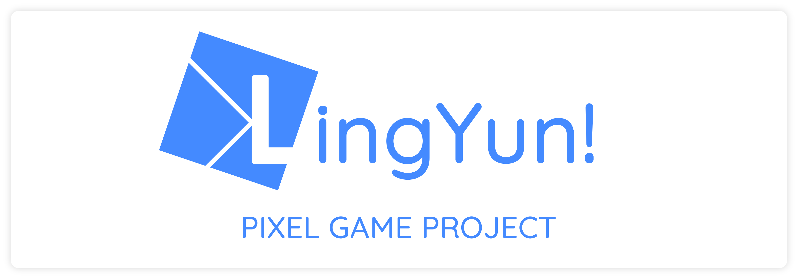

# PixelGame

Rogue-Lite Game like MOBA  
~~**Private 项目, 请注意保密性**~~

[itch](https://gikode.itch.io/legendarist)

[Git & Github 使用教程](https://www.liaoxuefeng.com/wiki/896043488029600) 

### 合作者
> [GiKode](https://github.com/AugustToko)  
> [Ivan](https://github.com/2233431914)  
> [Spark-yan](https://github.com/Spark-yan)  
> [morl0c](https://github.com/morl0c)  
> [GeG](0.0.0.0)

### 组织: ~~[PixelGame](https://gitlab.com/pixelgame?nav_source=navbar)~~

### 项目管理: [Pixel-Project](https://github.com/AugustToko/PixelGame)

### 建议
> 1. **使用 GPG 验证而非 SSH**  

### 场景顺序
> 0. TestWarning
> 1. SplashScene
> 2. MainScene
> 3. TownScene
> 4. LevelChooseScene

### 项目规范
> 1. 所有子项目 `Assets/PixelGameAssets` 下, 必须带有 README.md 文件, 切内含有效信息
> 2. 如果有必要, 请带上 CHANGELOG.md 和 CONTRIBUTORS.md
> 3. 如非特殊情况, 请使用 Rider IDE
> 4. 非拥有者请不要提交 .idea 文件夹
> 5. 非拥有者请不要提交 Library 文件夹
> 6. 所有无版权素材请在测试版之前移除
> 7. 如得到版权请声明

### 提交规范
> 1. 本项目内所以资源均采用 Github Pull Request 发起请求, 由项目持有者 [Gikode] 进行审核.
> 2. 步骤 fork -> clone -> commit -> push -> pull request.
> 3. 如果没有强调请提交代码或者其他资源文件请务必带上 `.meta` 文件
> 4. commit 必须带有有效信息
> 5. commit 必须签名
> 6. 请尽量使用 `GPG` 密钥而非 `SSH`

### 问题素材
> ...

### 无版权素材列表
> ...

### 第三方(开源)库
> 1. **PixelGame/Assets/PixelGameAssets/Third-Party/Joystick Pack**
> 2. **PixelGame/Assets/PixelGameAssets/Third-Party/TextMesh Pro**
> 3. **PixelGame/Assets/PixelGameAssets/Third-Party/Tilemap**
> 4. **PixelGame/Assets/PixelGameAssets/Third-Party/MonsterLove**
> 5. **PixelGame/Assets/PixelGameAssets/Third-Party/Exporter**
> 6. **PixelGame/Assets/PixelGameAssets/Third-Party/Ocias**
> 7. 待完善

### 待处理代码
> 1. PixelGame/Assets/PixelGameAssets/Scripts/Camera/PixelCameraFollower.cs
> 2. PixelGame/Assets/PixelGameAssets/Scripts/Core/Actor.cs
> 3. ...

### 第三方库
> 1. PixelGame/Assets/PixelGameAssets/Third-Party
> 2. 待完善

### 免费版权素材
> 1. Audio
>> https://audionautix.com/index.php  
>> 爱给网  
>> freeSounds
> 2. 待完善

### Issue
>1. 待完善
